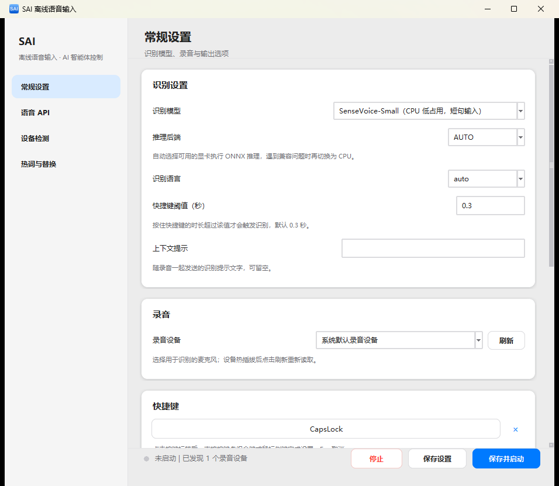

# SAI



> **按住快捷键说话，松开就上屏。默认 CapsLock，可在图形界面里自由改键。**

**下载**：[Releases](https://github.com/cskkxjk/SAI/releases/latest) 里的 Windows 安装包，或者直接 clone 源码运行。

**SAI** 是一个专为 Windows 打造的离线语音输入与 AI 智能体控制工具，
默认使用本地模型，也支持可选的 OpenAI 兼容语音转写 API。

> [!NOTE]
> **SAI 是 [CapsWriter-Offline](https://github.com/HaujetZhao/CapsWriter-Offline) 的 Windows 桌面分支。**
> 上游项目由 [Haujet Zhao](https://github.com/HaujetZhao) 开发，离线识别、热词系统、LLM 角色等
> 核心能力均来自上游（原项目图标、名称与版权归上游所有）。本分支在其基础上重做了桌面体验：
>
> - 全新的图形启动器：识别设置、录音、快捷键、模型文件、热词与替换、语音 API、设备检测
>   集中在同一窗口，美术风格参考 [clash-verge-rev](https://github.com/clash-verge-rev/clash-verge-rev)
> - 一键安装包：开始菜单/桌面快捷方式、卸载入口，安装目录与用户数据分离
> - 快捷键可自由修改（键盘组合键、鼠标侧键），不再局限于 CapsLock
> - 内置模型下载与校验、硬件检测与建议配置、远端 OpenAI 兼容 API 转写
> - 热词、别名与正则替换规则可直接在图形界面内编辑并保存
>
> 版权与授权说明见 [LICENSE](LICENSE) 与文末「致谢」。

## ✨ 核心特性

-   **语音输入**：按住快捷键（默认 `CapsLock`，可在界面里改成任意键盘组合键或鼠标侧键）说话，松开即输入，默认去掉末尾逗号句号；支持按住说话与单击开始/停止两种模式。
-   **文件转录**：SAI 在托盘中运行时，把音视频文件拖到 `SAI.exe` 上即可得到字幕 (`.srt`)、文本 (`.txt`) 与字级时间戳 (`.json`)，结果保存在原文件旁边。
-   **数字 ITN**：自动将「十五六个」转为「15~16个」，支持各种复杂数字格式。
-   **热词替换**：在 `hot.txt` 记下偏僻词，通过音素模糊匹配，相似度大于阈值则强制替换；也可以在「热词与替换」页用表格编辑。
-   **正则替换**：在 `hot-rule.txt` 用正则或简单等号规则，精准强制替换。
-   **LLM 角色**：预置了润色、翻译、助理等角色，识别结果以角色名开头时交给该角色处理，输出可以打字上屏或在 Toast 里显示。
-   **托盘控制**：录音时托盘图标变红，松开恢复；右键托盘图标可以打开配置、打开数据目录或退出。
-   **C/S 架构**：模型推理在服务端进程，录音与上屏在客户端，互不阻塞；也可以单独跑一台局域网服务端，客户端只负责输入。
-   **日记归档**：按日期保存你的每一句语音及其识别结果。
-   **录音保存**：录音可保存为本地音频文件；API 模式会把录音上传到配置的服务。
-   **更新提醒**：启动后自动检查 GitHub Releases，有新版本时左上角 SAI 旁显示 `new` 徽标；
    可查看更新说明、下载安装包，安装版支持静默覆盖升级并自动重启；可在选项里关闭自动检查或跳过指定版本。

### OpenAI 兼容语音 API

除本地模型外，Windows 图形配置页还支持 `OpenAI 兼容 API`。选择该模式后不需要
准备 `models` 目录，也不会加载本地 ASR 模型；录音片段会发送到配置的
`/audio/transcriptions` 接口，返回的文字仍会经过本项目现有的热词、替换和上屏流程。

在“语音 API”页填写：

1. **服务地址**：例如 `https://api.openai.com/v1`，或兼容服务的 `/v1` 地址。
2. **模型名称**：例如 `whisper-1`，以服务端实际支持的模型名为准。
3. **API Key**：保存在当前用户数据目录的 `config_gui.json` 中；也可以留空并使用
   环境变量 `SAI_ASR_API_KEY`。
4. **请求超时**：默认 60 秒。
5. **允许明文 HTTP**：仅用于可信局域网服务（例如 `http://192.168.1.10:8000/v1`），
   默认关闭；开启后该地址允许使用 HTTP，并且不走系统代理直连。

远程地址默认要求使用 HTTPS；本机服务可使用 `http://127.0.0.1`、`http://localhost` 或
`http://[::1]`。访问局域网 HTTP 服务时请开启“允许明文 HTTP”。本机和局域网地址始终
绕过系统代理直连，避免开了代理后访问不到内网服务。启用 API 模式时程序会再次确认，
因为录音和上下文提示会离开本机，服务商可能按请求收费。该模式沿用现有分段策略，长录音
可能在松键前就提交片段，不是实时流式接口；网络延迟会影响最终文字出现时间。失败不自动
重试，以避免重复计费。API 没有提供时间戳时，字幕时间仅为估算，不适合精确对齐。

服务必须支持语音转写，不是只有 `/chat/completions` 就能使用。上下文作为可选 `prompt`
提交，语言自动检测时不发送 `language`；若服务不支持这些可选字段，可清空上下文、
选择自动语言。Key 为明文，请勿共享个人配置文件或将其提交 Git。

安装包不包含模型。首次打开后，在“识别设置”
将识别模型切换为“OpenAI 兼容 API”，填写参数后“保存并启动”。

**SAI 想做到的是**：完全离线（不受网络限制）、响应极快、高准确率、高度自定义，用起来有「如臂使指」的流畅感，成为专属的一体化输入工具。默认识别全部在本地完成，录音不出本机；需要时也可以改用 OpenAI 兼容的转写服务（本机、局域网或云端）。安装版把程序与个人数据分开存放，也可以直接复制整个程序目录当便携版，换一台电脑、甚至保密电脑插上就能用。

以下为支持的模型：

| 引擎名 | 准确性 | 速度 | 格式 | 显卡加速 |
|------|-------|------|------|---------|
| Paraformer | ★★★☆☆ | ★★★★★ | ONNX | ❌ |
| SenseVoice-Small | ★★★☆☆ | ★★★★★ | ONNX | ✅ |
| Fun-ASR-Nano | ★★★★☆ | ★★★★☆ | ONNX + GGUF | ✅ |
| Qwen3-ASR | ★★★★★ | ★★★☆☆ | ONNX + GGUF | ✅ |


性能参考（20s 音频转录延迟）：

| 模型 | CPU U9-285H | GPU RTX5050 |
|------|------------|------------|
| Paraformer | 0.6s | - |
| SenseVoice-Small | 0.6s | 0.15s |
| Fun-ASR-Nano | 2.0s | 0.5s |
| Qwen3-ASR-1.7B | 4.0s | 1.0s |

详细功能说明请参考 [`docs/`](docs/) 目录：
- [环境依赖安装说明](docs/环境依赖安装说明.md) — VC++ 运行库、FFmpeg 安装
- [热词功能如何使用](docs/热词功能如何使用.md) — 热词替换、规则替换、自定义短语
- [角色功能如何使用](docs/角色功能如何使用.md) — LLM 角色配置、输出模式、创建新角色
- [识别语言如何配置](docs/识别语言如何配置.md) — 各引擎语言支持范围与配置方法
- [文件转录功能如何使用](docs/文件转录功能如何使用.md) — 拖拽转字幕、时间戳对齐
- [显卡加速的若干问题](docs/显卡加速的若干问题.md) — DirectML、Vulkan 加速配置
- [模型下载的若干问题](docs/模型下载的若干问题.md) — 引擎选择、模型下载、目录结构
- [常见问题](docs/常见问题.md) — FAQ
- [更新日志](docs/CHANGELOG.md) 


## 💻 平台支持

SAI 目前只在 **Windows 10/11 (64 位)** 上构建和测试，安装包与便携目录也只面向 Windows。

- **Linux / MacOS**：本分支没有做适配与打包；上游 CapsWriter-Offline 可在这些系统上用源码运行。


## 🎬 快速开始

### Windows 安装版与源码构建

#### 使用安装向导

安装包位于 `dist/installer`，运行 `SAI-1.0.4-Setup.exe`。
这是不含模型的单文件安装包，只需复制 Setup.exe，不再需要旁边的 `.bin` 文件。
安装过程不下载模型；首次使用本地识别时，在程序配置页从 ModelScope 按需下载。

1. 选择安装语言，接受许可证。
2. 选择安装路径，默认是当前用户的 `%LOCALAPPDATA%\Programs\SAI`。
3. 选择**数据存放目录**，默认 `%LOCALAPPDATA%\SAI`（配置、热词、日志、录音与日记）。想放到其它磁盘就在这里改，升级安装会沿用上次的选择。
4. 安装程序和运行库，不需要预先选择或准备模型。
5. 选择开始菜单目录，可勾选创建桌面快捷方式，点击“安装”。
6. 启动后在“识别设置”选择模型，检查“状态”，缺少文件时点击“下载模型”。
7. 等待下载和校验完成，选择麦克风并点击“保存并启动”。安装包默认模型是 Fun-ASR-Nano。

模型下载到 **安装目录下的 `models` 文件夹**，不是用户配置目录。请安装到当前用户可写
且空间充足的目录。SenseVoice 和 Paraformer 会自动下载标点模型。
下载直连 ModelScope，不使用系统代理；进度显示已完成与总字节数，可取消。
下载以 `.part` 临时文件保存，大小和 SHA256 校验通过后才替换正式文件。
失败或取消会清除当前未完成文件，已完成文件保留；再次下载会先校验并跳过完整文件。
“刷新状态”检查文件是否存在及非空；“校验／修复模型”联网执行完整 SHA256 校验，
修复大小正确但内容损坏的文件。API 模式不需要下载任何模型。
下载时不可启动识别，识别运行时需先停止再下载，防止替换正在使用的文件。

**Qwen3-ASR 量化版本：** 选择 Qwen3-ASR 后，“Qwen 量化”下拉框可选择
`q5_k`（默认，独显优先，解码器约 1.47 GB）或 `q4_k`（集显／低显存可尝试，
解码器约 1.28 GB）。两个版本共用 INT4 ONNX 编码器，当前编码器走 CPU；
GGUF 解码器按 GPU 设置运行。具体延迟和效果以自己的录音测试为准。
各自保存为 `qwen3_asr_llm.q5_k.gguf` 和 `qwen3_asr_llm.q4_k.gguf`，可同时保留。
切换后检查状态、下载缺少文件，再“保存并启动／重启”才能生效。
旧版 `qwen3_asr_llm.gguf` 点击下载时会先校验，匹配所选版本才改名复用。
命令行可用 `python download_models.py qwen_asr --quantization q4_k`。

若旧安装版 Qwen 输出重复问号或“解码有误，强制熔断”，请更新修复版：
旧版按需下载缺少来源记录，可能使 INT4 编码器误用 DirectML。新版对默认编码器文件名
直接启用 CPU 兼容保护，不依赖来源记录；GGUF GPU 解码不受影响。
解码重试仍失败时只通知错误，不再将失败文本输入当前窗口。已有模型无需重新下载。

**设备检测：** 打开配置窗口后，“设备检测”页自动显示 CPU、核心／线程数、系统内存、
显卡型号与厂商、专用显存、共享内存上限，以及 Vulkan 驱动入口和 ONNX 运行库后端。
Windows 使用 DXGI 读取显存，支持 AMD、NVIDIA、Intel 和多显卡；软件适配器会被排除。
共享内存不是显卡当前可用显存，检测驱动入口也不等于模型 GPU 推理已经验证成功。

建议是保守的容量估计，不是性能测试：专用显存至少 4 GiB 时优先试 Qwen Q5_K，
2–4 GiB 时试 Q4_K，共享内存型设备先试 Fun-ASR-Nano；无已识别硬件显卡、未发现
Vulkan 或系统内存不足时先试 SenseVoice CPU。NVIDIA 预加速默认不建议开启。
界面不会自动覆盖配置；点击“应用建议到配置”并确认后，才填入模型、量化和 GPU 选项，
不更改麦克风、密钥或热词，也不会自动下载、保存或启动。之后按常规流程下载模型、
保存并启动。实际使用哪块 GPU 以启动日志为准，目前不检测 GPU 空闲率或剩余显存。

安装版已经包含 Python 和推理库，不需要安装 Python、Git 或 uv。
它是当前用户安装，不默认请求管理员权限；自选目录必须是当前用户可写的位置。
可以通过 Windows“已安装的应用”或开始菜单中的卸载入口卸载。
程序设置、热词、LLM 角色和录音保存在 `%LOCALAPPDATA%\SAI`（安装时可改，装完后也能在
「录音」卡片点「更改...」换位置，会询问是否把已有数据整体迁移过去）；
托盘菜单“打开数据目录”可以打开它；更新和卸载不会删除这些个人数据。

旧便携版数据不会自动迁移。退出新旧两版并做好备份后，将旧版的 `config_gui.json`、
`hot.txt`、`hot-rule.txt`、`hot-server.txt`、`LLM` 和需要保留的年份目录复制到上述数据目录；
不要复制旧版 `core`、`internal` 或 DLL。安装版和便携版不要同时运行。
安装包未配置代码签名，发布者身份提示不能作为已签名发行版看待。

下面是从用户 fork 构建 Windows 统一版 EXE 的完整流程。构建完成后，日常使用只需要双击一个
`SAI.exe`，不需要分别启动服务端和客户端。

这是目录式便携版，不是单文件安装包。只想在另一台电脑上使用时，可以复制完整的
`dist/SAI` 文件夹，无需安装 Python 或 Git；仍需满足下面的 Windows
运行环境要求，并在新电脑上重新选择录音设备。

Git 仓库只提供源码、构建配置和说明，不包含 EXE、模型、llama.cpp DLL 或你的录音。
因此 `git clone` 后需要按第 1～6 步准备环境并构建，不能直接找到一个已编译的 EXE。
以下命令均在 **Windows PowerShell** 中执行；不要在 WSL 中运行这些命令来构建 Windows EXE。

#### 1. 安装构建环境

在 Windows 10/11 64 位系统中准备：

- Git
- Python 3.14 x64（普通版，不使用自由线程实验构建），保留 Tcl/Tk
- uv，用于按 `uv.lock` 安装构建环境
- Inno Setup 6.7.3 或兼容的 6.x 版本，用于编译安装向导；仅构建便携版时不需要
- Microsoft Visual C++ Redistributable 2015-2022 x64
- 可选：FFmpeg。只有使用文件转录功能时才需要，并且 `ffmpeg.exe` 必须在 PATH 中

AMD、NVIDIA 和 Intel 显卡都可以运行。GGUF 解码器使用随 llama.cpp 发布包提供的 Vulkan
运行库；如果 Vulkan 初始化失败，程序会自动回退到 CPU。

#### 2. 克隆 fork

```powershell
git clone git@github.com:cskkxjk/SAI.git
cd SAI
```

如果本机还没有配置 GitHub SSH Key，可以改用：

```powershell
git clone https://github.com/cskkxjk/SAI.git
cd SAI
```

#### 3. 创建 Python 3.14 环境并安装锁定依赖

```powershell
python -m pip install uv
uv python install 3.14
uv sync --locked --group build
.\.venv\Scripts\python.exe -c "import tkinter, sounddevice, soundfile, sherpa_onnx, sentencepiece, gguf, onnxruntime, PyInstaller; print('构建依赖导入成功')"
```

不需要激活虚拟环境或修改 PowerShell 执行策略，后续始终调用
`.\.venv\Scripts\python.exe`。上面的第一个 `python` 可以是已有 Python，用于安装 uv；
没有 Python 时可先安装 Python 3.14 x64，再执行命令。安装 uv 后如命令无法找到，
重新打开终端或把其 Scripts 目录加入 PATH。
`pyproject.toml` 与 `uv.lock` 是当前推荐的构建依赖来源，使用阿里云 PyPI 镜像；
旧的 requirements 文件仅保留给原有启动流程，不作为本次升级的锁定构建环境。
依赖导入检查失败时先处理安装错误，不要跳过并直接打包。

#### 4. 模型按需下载（构建前可跳过）

模型文件不放入 Git 仓库，也不再打包进 EXE 安装包。构建前无需下载。
构建或安装后打开程序，在“识别设置”选择模型并点击“下载模型”即可。

如需直接从源码运行，可选用同一下载逻辑的命令行入口（下载到源码目录的 `models`）：

```powershell
.\.venv\Scripts\python.exe download_models.py all
```

该命令会下载并校验以下组件：

| 组件 | 用途 |
| --- | --- |
| Qwen3-ASR | 面向多语言和复杂口述；当前 INT4 编码器走 CPU，GGUF 解码可尝试 GPU |
| Fun-ASR-Nano | 从 HaujetZhao/Fun-ASR-Nano-2512-GGUF 下载当前引擎兼容文件 |
| SenseVoice-Small | 速度快、占用低，适合普通电脑和短句输入 |
| Paraformer | 当前配置使用 CPU，适合低占用输入 |
| Punct-CT-Transformer | 为 Paraformer 和部分文本流程提供标点 |

Fun-ASR-Nano 使用本 fork 当前自定义引擎所需的 GGUF/ONNX 文件，不能用任意同名模型替代。
GUI 和命令行会自动将四个文件下载到以下目录，无需手动解压：

```text
models/Fun-ASR-Nano/Fun-ASR-Nano-GGUF/model/
├── Fun-ASR-Nano-Encoder-Adaptor.fp32.onnx
├── Fun-ASR-Nano-CTC.int8.onnx
├── Fun-ASR-Nano-Decoder.q8_0.gguf
└── tokens.txt
```

如已手动放置模型，可检查目录是否存在（不是构建要求）：

```powershell
Test-Path models\Qwen3-ASR\Qwen3-ASR-1.7B\qwen3_asr_encoder_frontend.onnx
Test-Path models\SenseVoice-Small\Sherpa-ONNX\model.int8.onnx
Test-Path models\Paraformer\speech_paraformer-large-vad-punc_asr_nat-zh-cn-16k-common-vocab8404-onnx\model.onnx
Test-Path models\Fun-ASR-Nano\Fun-ASR-Nano-GGUF\model\Fun-ASR-Nano-Decoder.q8_0.gguf
```

输出 `True` 才表示对应文件已准备好。GUI 打开后也会在模型下拉框下方显示缺少文件数量。
上述命令仅检查代表文件，不代表全部文件已经齐全。打包前可检查 GUI 使用的全部文件清单：

```powershell
.\.venv\Scripts\python.exe -c "from pathlib import Path; from gui_launcher import MODEL_INFO; missing = [p for info in MODEL_INFO.values() for p in info['files'] if not Path(p).is_file()]; print('\n'.join(missing) if missing else '四套模型文件均已找到'); raise SystemExit(bool(missing))"
```

空间有限时只需下载打算使用的模型。即使源码目录已有模型，打包也不会复制它们。
未准备的模型仍会显示在下拉菜单中，点击“下载模型”后即可准备使用。

#### 5. 准备 llama.cpp 运行库

Qwen3-ASR 和 Fun-ASR-Nano 的 GGUF 解码器需要 llama.cpp 的 Windows Vulkan DLL。
**安装版自带**这套运行库；如果被杀毒软件隔离、误删或版本不符，桌面端「识别设置」
页的「推理运行库」会直接显示状态，点「修复运行库」即可联网下载、校验并覆盖安装
（下载走系统代理；无法访问 GitHub 时也可手动下载）：

<https://github.com/ggml-org/llama.cpp/releases/download/b10621/llama-b10621-bin-win-vulkan-x64.zip>

解压后把 DLL 全部复制到：

```text
core/server/engines/llama/bin/
```

至少应包含：

```text
llama.dll
ggml.dll
ggml-base.dll
ggml-vulkan.dll
ggml-cpu-x64.dll
libomp.dll
```

不要把这些 DLL 放入 `models`，也不要只复制 `llama.dll`。`.gitignore` 默认忽略 DLL，
所以其他设备从 Git clone 后仍需要完成这一步。
压缩包 SHA256 为 `2672d85bf87c8280d94dee01eb6a86280046878f70a07d786a93637fa9081163`；
可用 `Get-FileHash <压缩包路径> -Algorithm SHA256` 核对。保留仓库提供的
`core/server/engines/llama/bin/runtime-version.json`，构建时会检查版本。
升级时先把旧 bin 目录备份到其他位置，再放入新版 DLL，不要混用 b7798 和 b10621。
若需要用自建镜像代替 GitHub，可设置环境变量 `SAI_LLAMA_RUNTIME_URL`（压缩包地址）
与 `SAI_LLAMA_RUNTIME_SHA256`（对应 SHA256），或改 `runtime-version.json` 里的
`url` / `sha256` 字段。

#### 6. 构建统一 EXE

首次构建时，在仓库根目录执行：

```powershell
.\.venv\Scripts\python.exe -m PyInstaller --noconfirm build-desktop.spec
```

成功后，统一入口位于：

```text
dist/SAI/SAI.exe
```

请整体保留 `dist/SAI` 文件夹，不能只复制单个 EXE。构建程序会把源码中的
`core`、`assets`、配置文件和 LLM 角色目录一起复制到发布目录，但不复制模型。

可以把该文件夹复制到另一台 Windows x64 电脑，或整体压缩传输，解压后直接打开 EXE。
不要仅发送 `SAI.exe`；`internal` 是 Python 和第三方运行库，`core` 是程序代码，
`models` 是模型，`assets` 是界面资源，`LLM` 保存润色角色配置，均应随包保留。

**重新构建时保护旧数据：** `--noconfirm` 可能直接替换同名发布目录。
不要向正在使用、含个人配置和历史录音的目录直接打包。改用一个新的输出目录，例如：

```powershell
.\.venv\Scripts\python.exe -m PyInstaller --noconfirm --distpath dist-next build-desktop.spec
```

先确认 `dist-next/SAI/SAI.exe` 能正常运行，再退出旧程序并迁移自己的
`config_gui.json`、热词文件和需要保留的按年录音目录。不要用旧 `core`、`internal`
覆盖新程序；手工改过的 `config_client.py`、`config_server.py` 应比较后迁移配置。
再次构建时也不要重复覆盖已经在使用的 `dist-next`，应另选空目录。

**关于两层 dist 目录：** 当前规范入口是 `dist/SAI/SAI.exe`。
如果外层另有旧的 `dist/SAI.exe`、`dist/config_gui.json`，确认没有使用且无需保留后
可以删除。内层整个文件夹不是重复文件，而是当前完整程序。
需要平铺时，先退出程序、处理外层同名旧文件，再把内层所有内容一起移动到 `dist`；
EXE 和相邻资源必须保持相对位置。下次构建仍会生成内层目录，不会跟随手工搬移。

可选的源码回归检查（不需要启动识别服务，不使用真实麦克风；GUI 测试需 Windows 桌面会话）：

```powershell
.\.venv\Scripts\python.exe -m unittest discover -s tests -p regressions.py -v
.\.venv\Scripts\python.exe -m unittest discover -s tests -p microphone_lifecycle.py -v
.\.venv\Scripts\python.exe -m unittest discover -s tests -p audio_input_regressions.py -v
.\.venv\Scripts\python.exe -m unittest discover -s tests -p desktop_hotwords.py -v
.\.venv\Scripts\python.exe -m unittest discover -s tests -p upstream_merger.py -v
.\.venv\Scripts\python.exe -m unittest discover -s tests -p installer_paths.py -v
```

#### 6.1 编译带安装向导的 EXE

在全新的 staging 目录构建，再用 Inno Setup 编译：

```powershell
.\.venv\Scripts\python.exe -m PyInstaller --noconfirm --distpath build/installer-stage build-desktop.spec
& "${env:ProgramFiles(x86)}\Inno Setup 6\ISCC.exe" installer\SAI.iss
```

Inno Setup 安装路径不同时，请把第二条命令改成实际 `ISCC.exe` 路径。
安装包不需要任何模型文件。输出在 `dist/installer`，只有一个 Setup.exe。
旧版遗留的 `Setup-*.bin` 分卷文件不再使用，新版生成成功后可删除。
不要使用含个人日志、录音、API 密钥的旧发布目录作为安装包源；
默认配置来自 `installer/config_gui.json`，首次安装不会继承本机的麦克风设备选择。

打包后可执行离线诊断，不会录音或模拟键盘输入：

```powershell
.\build\installer-stage\SAI\SAI.exe --self-test
```

结果保存在数据目录的 `logs/self-test.json`。可加 `--model sensevoice --audio C:\path\sample.wav`
验证指定音频文件的实际识别；换成 `fun_asr_nano` 或 `qwen_asr` 可验证新版 GGUF 运行库。

#### 7. 第一次启动和配置

1. 双击 `dist\SAI\SAI.exe`。
2. 在“识别模型”下拉框中选择模型。
3. 查看模型下方的“建议”和“状态”文字：
   - Qwen3-ASR：适合多语言和复杂口述，推荐有独显的电脑。
   - Fun-ASR-Nano：准确率和速度均衡，适合日常中英文输入。
   - SenseVoice-Small：CPU 占用低，适合短句和普通电脑。
   - Paraformer：CPU 专用、速度快，不使用 GPU。
4. 在“录音设备”下拉框中选择实际使用的麦克风。
5. 如果设备列表不完整，点击“刷新设备”。
6. 点击“保存设置”只保存当前配置；点击“保存并启动”会保存配置并启动识别服务。
7. 启动成功后配置窗口自动隐藏到 Windows 右下角托盘。
8. 双击托盘图标可以重新打开配置页，在配置页点击“停止”可停止服务；
   右键托盘菜单可以打开配置或退出程序。

Windows 可能会通过 MME、DirectSound、WASAPI 和 WDM-KS 为同一个物理麦克风创建多个
音频端点。配置页会按设备名称进行物理设备去重，并优先保留 `Windows WASAPI` 入口，因此
列表中的数量通常会少于 Windows 音频设置中看到的端点数量。

#### 8. 使用语音输入

在 EXE 配置页点击“热词与替换”，默认打开“文字替换”表格，不需要编写代码：

1. “识别成了什么”填 `欧拉玛`，“替换成什么”填 `Ollama`。
2. 点击“添加”，再点“保存当前页”。修改已有条目时先选中表格中的一行，
   修改输入框后点“修改选中项”；删除使用“删除选中项”。
3. 在“测试原文”输入一句话，点击“测试替换”查看结果。
   普通替换按文字原样匹配，标点不需要转义；替换内容留空表示删除原词。

已有简单规则会显示在表格中，复杂正则保留在高级页，保存不会删除它们。
表格创建的条目由程序保存为 `hot-rule.txt` 内的 `@literal` 数据，不需要手工编辑。
升级程序时请连同 `core` 目录一起更新；旧版本不认识这种条目。

- “热词与别名（高级）”：每行 `目标词 | 别名`，例如 `SAI | 卡普斯赖特`，
  用于发音相近的纠错；这不是严格的逐字匹配。
- “正则规则（高级）”：每行 `查找内容 = 替换内容`，等号两侧保留空格，
  例如 `欧拉玛 = Ollama`。查找内容支持正则表达式；普通标点如 `.` 需写成 `\.`。
- 点击“测试替换”可预览规则替换结果，不会录音或向其他窗口输入文字；
  此测试只执行“规则替换”，不包含发音纠错或 LLM 润色。
- 点击“保存当前页”。运行中的客户端通常约 3 秒后自动重载，无需重启模型；
  未启动时会在下次启动加载。“文字替换”和“正则规则（高级）”共用一份文件；
  热词别名单独保存，关闭时会提醒未保存的修改。
- 便携版文件保存在 EXE 同目录的 `hot.txt` 和 `hot-rule.txt`；
  安装版保存在 `%LOCALAPPDATA%\SAI`，不是源码目录；
  保存前会检查规则格式、正则和文件是否被其他程序修改。

- 默认按需开启麦克风，松键或取消即关闭，空闲时不占用设备。
  部分 USB 麦克风重新开启后会有约 2 秒的无声冷启动期，立即说话可能丢失开头。
- 此类设备若需要即按即说，可勾选“快速响应（空闲时持续占用麦克风）”并保存重启：
  启动时短暂预热，之后保持采集，但空闲音频直接丢弃、不保存、不发送；
  只有按键录音期间的音频会进入识别。此模式下 Windows 显示麦克风正在使用是正常现象。
- 按住快捷键（默认 `CapsLock`）说话，松开后自动识别并输入到当前获得焦点的输入框；
  快捷键可在配置页的「快捷键」卡片里改成任意键盘组合键或鼠标侧键。
- 想改成长按/单击切换两种模式之一，在配置页把该快捷键的 `hold_mode` 改掉（按住模式为按下录音、
  松开停止；单击模式为按一下开始、再按一下停止），也可以用多个快捷键并分别设置模式。
- 目标程序如果以管理员身份运行，SAI 也需要以管理员身份运行，才能向目标窗口模拟输入。

识别服务、录音客户端和配置界面都由同一个 `SAI.exe` 管理。不要再单独运行旧的
`start_server.py`、`start_client.py` 或旧版 `dist-v*` 目录。


#### 9. 本 fork 的主要改动

2026-09-21 已合并上游至 `84912d5`：

- `39c3318`：强制对齐上下文由 3072 扩大到 4096。
- `84912d5`：跨分片匹配切点落在 token 内部时按字符拆分，避免空格或其他字符丢失，
  并保留窗口之外的历史内容。

- `47df96a`、`29a0c8b`：llama.cpp b10621 结构体及采样函数签名适配，
  同时保留本 fork 的 GPU 加载失败回退 CPU。
- `1a332b4`：Python 3.14 / uv 环境管理；本 fork 另外补齐模型下载和安装版构建依赖。

新版代码与 b7798 DLL 不兼容，必须整套升级并重新构建 EXE。

相对上游原版，本 fork 主要增加和调整了以下内容：

| 改动 | 说明 |
| --- | --- |
| 桌面图形界面 | 侧边导航 + 卡片式布局：常规设置、语音 API、设备检测、热词与替换集中在同一窗口，美术风格参考 clash-verge-rev |
| 一键安装包 | Inno Setup 安装程序，写入开始菜单/桌面快捷方式与卸载入口，安装目录与用户数据分离，并提供 `SAI.exe --self-test` 自检 |
| 可改快捷键 | 快捷键采集控件支持键盘组合键（左右 Ctrl/Alt/Shift/Win 可分别区分）、鼠标侧键与中键，默认 CapsLock 长按录音，可在界面中随时更换；改动后客户端几秒内热重载，无需重启、不重新加载模型 |
| 粘贴快捷键 | 可单独设置一个「粘贴快捷键」：用该键录音时结果一律用剪贴板 Ctrl+V 上屏，适合远程桌面、虚拟机等逐字输入不好使的场景 |
| 远程桌面适配 | 自动识别 mstsc / 深信服等远程与虚拟桌面：中文改用剪贴板（并自动加长剪贴板同步与恢复的等待时间），ASCII 改用 pynput 逐字键入，避免 `keyboard.write` 在转发层被搅乱 |
| Windows 统一入口 | `gui_launcher.py` 提供配置窗口、模型检查、服务启动和托盘管理，最终由 `SAI.exe` 统一运行 |
| 热词与替换编辑器 | 表格化的文字替换、热词别名与正则规则编辑，可直接在界面内保存并热重载 |
| 远端 API 转写 | 支持 OpenAI 兼容 `/audio/transcriptions`，可测试连接、允许可信局域网明文 HTTP、本地地址绕过系统代理 |
| 模型下载与校验 | 内置 ModelScope 下载、进度显示与文件校验，缺失时给出建议并支持取消 |
| 硬件检测 | 读取 CPU/内存/显卡/Vulkan/ONNX 后端信息，给出模型与量化建议并一键填入配置 |
| 录音设备选择 | 配置页读取 Windows 录音设备，保存实际设备名称和接口信息，启动前检查设备是否可用 |
| 物理麦克风去重 | 合并同一麦克风的 MME、DirectSound、WASAPI、WDM-KS 端点，并优先选择 WASAPI |
| 麦克风生命周期 | 默认松键释放设备；可选快速响应模式，空闲音频不保存、不发送；专用 COM 线程修复 Windows 设备打开失败 |
| 音频完整性 | 修复缓存切换丢帧，跳过全零录音和 `/sil` 输出，防止按住快捷键时反复失败重试 |
| GPU 容错 | 自动尝试可用的 DirectML/Vulkan 后端；GPU 初始化或推理失败时回退 CPU |
| GGUF/ONNX 兼容 | 增加 Qwen3-ASR、Fun-ASR-Nano 的模型接口和不同导出格式的兼容处理 |
| 发布构建 | `build-desktop.spec` 将代码、运行库、模型、配置和托盘资源整理为统一发布目录 |

> 命名说明：本分支由 CapsWriter-Offline 派生，由于快捷键已可自由修改，品牌更名为 **SAI**，
> 并启用了新的应用图标；代码中的 `SAI.exe`、`%LOCALAPPDATA%\SAI` 等均对应原
> `CapsWriter.exe`、`%LOCALAPPDATA%\CapsWriterOffline`，首次启动会自动迁移旧数据目录。

## ⚙️ 个性化配置

首次使用和日常修改优先通过 `SAI.exe` 配置页完成：模型、识别语言、推理后端、
录音设备、输出方式和 GPU 选项都可以在界面中保存。高级用户仍可以编辑发布目录中的
`config_server.py`、`config_client.py`、`hot.txt` 和 `hot-rule.txt`。


## 🛠️ 常见问题


**Q: 为什么按了没反应？**  
A: 确认已经双击统一入口 `dist\SAI\SAI.exe`，并在配置页点击
“保存并启动”。启动成功后主窗口会隐藏到托盘，右键托盘图标可以查看状态或退出。

**Q: 为什么识别结果没字？**  
A: 到录音文件夹中检查录音文件（界面「录音」卡片点「打开录音文件夹」即可直达 `年/月/assets`），看是不是没有录到音；听听录音效果，是不是麦克风太差，建议使用桌面 USB 麦克风；检查麦克风权限。

**Q: 想要隐藏黑窗口？**  
A: 统一 EXE 默认不显示黑色控制台窗口，启动成功后配置窗口会隐藏到右下角托盘。

**Q: 如何开机启动？**  
A: `Win+R` 输入 `shell:startup` 打开启动文件夹，将
`dist\SAI\SAI.exe` 的快捷方式放进去即可。

**Q: 如何修改快捷键？**
A: 打开配置页，在「快捷键」卡片点击按键标签后直接按新的键盘组合键或鼠标侧键即可，
设置会随「保存设置」写入配置。仍支持按住说话（`hold_mode=True`）与单击开始/停止两种模式；
高级用户也可以直接编辑 `config_client.py` 中的 `ClientConfig.shortcuts`。

**Q: Windows 如何使用统一图形界面？**
A: 构建 `build-desktop.spec` 后，双击 `dist/SAI/SAI.exe`，在配置页
选择模型和录音设备，点击“保存并启动”。成功后窗口会隐藏到托盘。

更多问题请参阅 [docs/常见问题.md](docs/常见问题.md)。


## ❤️ 致谢

本分支（SAI）派生自 [**CapsWriter-Offline**](https://github.com/HaujetZhao/CapsWriter-Offline)，
原作者为 [Haujet Zhao](https://github.com/HaujetZhao)。离线 ASR 引擎、音素热词检索、
文本合并、LLM 角色等核心实现均来自上游，原项目名称、图标与版权归上游所有；
本分支在其基础上重做了 Windows 桌面体验并更名为 SAI，详见
[LICENSE](LICENSE)（保留上游版权声明）与上文「本 fork 的主要改动」。

本项目还基于以下优秀的开源项目：

-   [Sherpa-ONNX](https://github.com/k2-fsa/sherpa-onnx)
-   [FunASR](https://github.com/alibaba-damo-academy/FunASR)

界面（配色、卡片与侧边导航布局）参考了 [**Clash Verge Rev**](https://github.com/clash-verge-rev/clash-verge-rev)，
特此致谢。

感谢 Codex 与 opencode，本分支的桌面界面重做、安装包构建与各项 Windows 适配大量借助它们完成。

如果这个分支对你有帮助，欢迎在 [本仓库](https://github.com/cskkxjk/SAI) 点个 Star；
也请多多支持上游项目 [CapsWriter-Offline](https://github.com/HaujetZhao/CapsWriter-Offline)。
